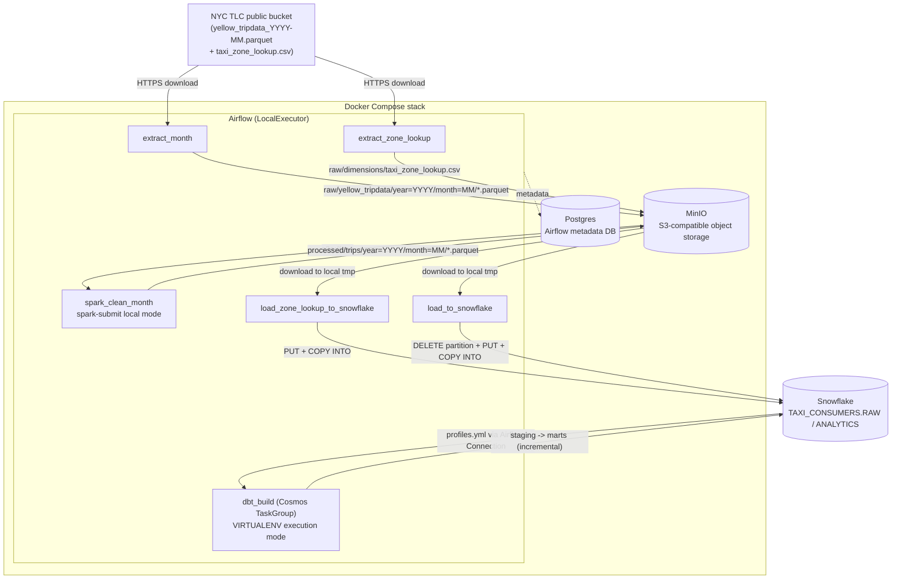

# Kiến trúc dự án — NYC Taxi Analytics Engineering Platform

> Tài liệu này mô tả kiến trúc kỹ thuật hiện tại của pipeline, dựa trên code thực tế trong repo (không phải kế hoạch). Xem [CLAUDE.md](../CLAUDE.md) để biết bối cảnh, quyết định thiết kế và roadmap; xem [errors_and_fixes.md](./errors_and_fixes.md) để biết các lỗi thực tế đã gặp và cách sửa.

## 1. Mục tiêu

Portfolio project mô phỏng một pipeline Analytics Engineering thực chiến, khép kín 4 kỹ năng: **Airflow, Docker, Apache Spark/PySpark, Snowflake** (dbt và CI/CD đã vững từ dự án khác). Dữ liệu: NYC TLC Yellow Taxi Trip Records, trọn năm **2024** (12 file parquet theo tháng) + `taxi_zone_lookup.csv`.

## 2. Sơ đồ kiến trúc tổng thể



## 3. Luồng dữ liệu theo từng bước (grain = 1 tháng / lần chạy DAG)

DAG `taxi_pipeline` (`airflow/dags/taxi_pipeline_dag.py`) chạy `@monthly`, `catchup=True`, `start_date=2024-01-01`, `end_date=2024-12-31`, `max_active_runs=1` → đúng 12 lần chạy, mỗi lần xử lý trọn vẹn 1 tháng từ đầu đến cuối (extract → Spark → Snowflake → dbt), hỗ trợ backfill/replay từng tháng độc lập.

| # | Task | Việc làm | Idempotent bằng cách nào |
|---|------|----------|---------------------------|
| 1 | `extract_month` | Tải `yellow_tripdata_YYYY-MM.parquet` từ TLC, ghi vào MinIO `raw/yellow_tripdata/year=/month=/` | Skip nếu key đã tồn tại (`check_for_key`) |
| 2 | `extract_zone_lookup` | Tải `taxi_zone_lookup.csv` (dimension tĩnh, chỉ cần 1 lần) | Skip nếu key đã tồn tại |
| 3 | `spark_clean_month` | `spark-submit` PySpark job, đọc raw từ MinIO qua `s3a://`, clean + enrich, ghi vào `processed/trips/year=/month=/` | `write.mode("overwrite")` trên đúng partition tháng đó |
| 4 | `load_zone_lookup_to_snowflake` | Download CSV từ MinIO → `PUT` vào internal stage → `COPY INTO RAW.ZONE_LOOKUP` | Skip nếu bảng đã có row (`SELECT COUNT(*)`) |
| 5 | `load_to_snowflake` | Download parquet đã clean → `DELETE` partition tháng đó trong `RAW.TRIPS` → `PUT` + `COPY INTO ... MATCH_BY_COLUMN_NAME` | `DELETE` trước khi load lại — tránh nhân đôi dữ liệu khi rerun (xem lỗi #12) |
| 6 | `dbt_build` (Cosmos `DbtTaskGroup`) | `stg_trips`/`stg_zones` → `dim_zone`/`dim_date`/`fct_trips` (incremental)/`fct_trips_daily_summary`, kèm test | `fct_trips` dùng `delete+insert` theo `(pickup_year, pickup_month)` |

Dependency graph trong DAG:
```
[extract_month, extract_zone_lookup] >> spark_clean_month
extract_zone_lookup >> load_zone_lookup_to_snowflake
spark_clean_month >> load_to_snowflake
[load_zone_lookup_to_snowflake, load_to_snowflake] >> dbt_build
```

## 4. Thành phần hạ tầng (Docker Compose)

| Service | Image / build | Vai trò |
|---|---|---|
| `postgres` | `postgres:16` | Metadata DB cho Airflow |
| `minio` | `minio/minio:latest` | Data lake S3-compatible (port 9000 API, 9001 console) |
| `minio-createbuckets` | `minio/mc:latest` | One-shot: tạo bucket `raw` + `processed` rồi thoát |
| `airflow-init` | custom (`airflow/Dockerfile`) | One-shot: `airflow db migrate`, tạo user admin, tạo pool `dbt_pool` (1 slot) |
| `airflow-webserver` | custom | UI tại `:8080` |
| `airflow-scheduler` | custom | `LocalExecutor`, chạy task |

Image Airflow custom (`apache/airflow:2.10.4-python3.11`) thêm `default-jdk-headless` + `procps` để PySpark chạy được (JVM + `ps`). Spark chạy `local[*]` ngay trong container Airflow — không có Spark cluster riêng ở v1.

Kết nối tới MinIO/Snowflake khai báo qua biến môi trường `AIRFLOW_CONN_MINIO_DEFAULT` / `AIRFLOW_CONN_SNOWFLAKE_DEFAULT` (JSON, trong `.env`) — không click tay qua UI, và dbt (qua Cosmos `SnowflakeUserPasswordProfileMapping`) tái sử dụng đúng Airflow Connection Snowflake này làm nguồn credential duy nhất.

## 5. PySpark — `spark_jobs/clean_trips.py`

- Đọc parquet tháng đó + `taxi_zone_lookup.csv` từ `s3a://raw/...` (driver `hadoop-aws:3.3.4` + `aws-java-sdk-bundle:1.12.262`, pin khớp với `pyspark==3.5.3`, kéo về lúc `spark-submit --packages` chứ không bake vào image).
- Rename `tpep_pickup_datetime`/`tpep_dropoff_datetime` → `pickup_datetime`/`dropoff_datetime`.
- Lọc rác: null/timestamp sai thứ tự, `trip_distance`/`fare_amount`/`total_amount`/`passenger_count` ≤ 0, trùng lặp (`dropDuplicates`).
- Tính `trip_duration_minutes` bằng `F.unix_timestamp(...)` (không `.cast("long")` vì cột là `TIMESTAMP_NTZ`).
- Broadcast join 2 lần với zone lookup (pickup + dropoff) → thêm `pickup_borough`/`pickup_zone`/`dropoff_borough`/`dropoff_zone`.
- Ghi ra `processed/trips/year=YYYY/month=MM/` dạng Parquet, `overwrite`.

Lưu ý: các cột borough/zone Spark tự enrich **không** được dbt dùng lại — tầng staging/marts cố tình join lại từ `ZONE_LOOKUP` riêng để có star schema thật + test `relationships` (xem `scripts/snowflake_setup.sql` dòng ghi chú và `models/staging/stg_trips.sql`).

## 6. Snowflake — object model

Namespace thật (không phải kế hoạch ban đầu): database `TAXI_CONSUMERS`, warehouse `TAXI_CONSUMER`, schema `RAW` (landing) + `ANALYTICS` (dbt target), role service `SPYNO_ANALYST`, login `spyno_mac`.

- `RAW.TRIPS` — bảng landing, nạp bằng internal stage `RAW.TRIPS_STAGE` + file format `PARQUET_FORMAT` (**`USE_LOGICAL_TYPE = TRUE` bắt buộc**, nếu không timestamp INT64 microsecond của Spark bị đọc sai đơn vị → ra năm rác như 3728527 — xem lỗi #13).
- `RAW.ZONE_LOOKUP` — bảng dimension tĩnh, nạp qua `ZONE_LOOKUP_STAGE` + `CSV_FORMAT`, `COPY INTO` positional (CSV không có column-name metadata).
- Loading pattern: **internal stage + PUT + COPY INTO**, không dùng external stage — vì MinIO chạy localhost, Snowflake không reach qua network được; internal stage tránh hoàn toàn vấn đề này, vẫn luyện đúng kỹ năng `COPY INTO`.

## 7. Data model (dbt) — `dbt/taxi_dbt/models`

```
source: raw.trips, raw.zone_lookup
  └─ staging: stg_trips (rename/cast), stg_zones (rename/cast)
       └─ marts:
            dim_zone            (từ stg_zones)
            dim_date            (date_spine 2024-01-01 .. 2025-01-01, dbt_utils)
            fct_trips           (từ stg_trips, incremental)
                 └─ fct_trips_daily_summary  (pre-aggregate cho dashboard)
```

- **`fct_trips`**: `materialized='incremental'`, `incremental_strategy='delete+insert'`, `unique_key=['pickup_year','pickup_month']`. Logic: high-water-mark trên `pickup_datetime` (`is_incremental()` filter) **kết hợp** delete+insert theo tháng — chọn kiểu này thay vì `append` thuần vì `append` từng nhân đôi dữ liệu khi task load bị rerun (xem lỗi #12). Đây là narrative trung tâm của dự án: mỗi lần chạy/backfill DAG map với đúng 1 tháng, thay vì full-refresh một cục.
- **Tests**: `not_null`/`unique` trên khóa chính các dim; `relationships` test nối `fct_trips.pickup_location_id/dropoff_location_id` → `dim_zone.location_id`, `fct_trips.pickup_date` → `dim_date.date_day`; custom singular test `assert_no_invalid_amounts.sql` (kiểm tra độc lập lại lần nữa fare/total/distance > 0 và dropoff > pickup — phòng thủ 2 lớp, không tin tưởng mù quáng vào Spark).
- Cú pháp `relationships` test cố tình dùng dạng phẳng `to:`/`field:` thay vì lồng dưới `arguments:` — vì Cosmos `LoadMode.CUSTOM` parser không detect được `ref()` lồng sâu, làm rớt cạnh phụ thuộc và khiến test chạy trước khi bảng dim tồn tại (lỗi #11).

## 8. dbt chạy trong Airflow như thế nào (Cosmos)

- **Không** cài `dbt-core`/`dbt-snowflake` vào image Airflow — xung đột dependency không thể resolve với `apache-airflow` (jinja2, click, ...). Thay vào đó dùng `ExecutionConfig(execution_mode=ExecutionMode.VIRTUALENV)`: Cosmos tự dựng virtualenv riêng cho dbt tại runtime task.
- `RenderConfig(load_method=LoadMode.CUSTOM)`: Cosmos parse trực tiếp file `.sql`/`.yml` của project để dựng graph, **không** shell ra `dbt ls` lúc DAG parse (vì không có binary `dbt` ngoài virtualenv → sẽ lỗi `Unable to find the dbt executable`).
- Tất cả task Cosmos sinh ra dùng chung 1 Airflow Pool `dbt_pool` (1 slot, tạo trong `airflow-init`) — vì chúng share chung `virtualenv_dir`, chạy song song lần đầu sẽ race trên `pip install` và hỏng install (lỗi #10). Trade-off: phần dbt của mỗi lần chạy tuần tự hoàn toàn, chậm hơn nhưng an toàn.
- `profile_config` build `profiles.yml` từ **cùng** Airflow Connection Snowflake mà các Python task dùng — một nguồn credential duy nhất, không copy riêng cho dbt.

## 9. Quyết định thiết kế chính (không nên đảo ngược nếu không có lý do tốt)

- **Không dùng Apache Flink/streaming** — batch-only, vì JD Analytics Engineering không đòi hỏi và sẽ nổ timeline.
- **Spark local mode** trong 1 container, không cluster riêng — đủ để chứng minh kỹ năng PySpark thật, cluster distributed là stretch goal.
- **MinIO** đóng vai trò data lake trung gian raw→processed; nếu tốn quá nhiều thời gian setup, fallback là Spark đọc/ghi filesystem local.
- **Internal stage**, không external stage — do MinIO chạy localhost, Snowflake không với tới qua mạng thật.
- **Incremental theo tháng** là câu chuyện trọng tâm của dự án cho phỏng vấn — không được gộp lại thành 1 job full-load.
- Snowflake trial 30 ngày là đồng hồ cứng (bắt đầu 2026-07-17) → cần chụp ảnh/screenshot, export `dbt docs generate`, quay demo **trước khi** trial hết hạn, vì đó là bằng chứng duy nhất còn lại sau khi account bị xoá.

## 10. Repo layout

```
taxi_consumer/
├── docker-compose.yml
├── airflow/
│   ├── Dockerfile
│   └── dags/taxi_pipeline_dag.py
├── spark_jobs/clean_trips.py
├── dbt/taxi_dbt/
│   ├── dbt_project.yml
│   ├── packages.yml            # dbt_utils (date_spine)
│   ├── models/staging/         # stg_trips, stg_zones, src_taxi.yml
│   ├── models/marts/           # dim_zone, dim_date, fct_trips, fct_trips_daily_summary
│   └── tests/assert_no_invalid_amounts.sql
├── scripts/snowflake_setup.sql
└── docs/errors_and_fixes.md
```

## 11. Trạng thái hiện tại (2026-07-19)

- **Week 1-2**: đã verify end-to-end qua chính Airflow (không chỉ chạy tay) — MinIO `raw/` đủ 12 tháng + zone lookup; `processed/trips/year=2024/month=0{1,2}/` có parquet đã clean/enrich.
- **Week 3**: **hoàn thành và verify end-to-end thật 100%** — trigger `taxi_pipeline` cho tháng 1/2024, cả 17 task (5 task Python + 12 task dbt qua Cosmos) đều `success`. Kết quả cuối: `fct_trips` 2,723,733 dòng (toàn bộ nằm đúng trong tháng 1/2024, không còn dòng lỗi ngoài tháng), `dim_zone` 265 zone, `dim_date` 366 ngày, `fct_trips_daily_summary` 6,662 dòng. Gặp và fix 14 lỗi thật trong quá trình này (xem [errors_and_fixes.md](./errors_and_fixes.md)), bao gồm 1 lỗi nghiêm trọng (Snowflake đọc sai timestamp Parquet do thiếu `USE_LOGICAL_TYPE=TRUE`) và 1 đặc điểm thật của data TLC (một số dòng có pickup date ngoài tháng của file, do lỗi thiết bị ghi nhận của taxi).
- **Week 4** (đang làm): Streamlit dashboard, README hoàn chỉnh, `dbt docs`, GitHub Actions CI.

## 12. Bài học vận hành đáng chú ý

Gần như toàn bộ lỗi thực tế gặp phải (14 lỗi, xem chi tiết ở [errors_and_fixes.md](./errors_and_fixes.md)) đều cùng một dạng: **an toàn ở lần chạy đầu tiên nhưng không an toàn ở lần thứ N** — rerun, retry, backfill, task chạy song song. Idempotency và concurrency, không phải logic happy-path một lần — đúng bản chất debugging trong data engineering thực tế. Riêng lỗi #13 (timestamp) và #14 (data quirk TLC) là nhắc nhở thêm: dữ liệu thật luôn có bất ngờ mà không bộ test giả định trước nào lường hết được — phải chạy thật với data thật mới lộ ra.
